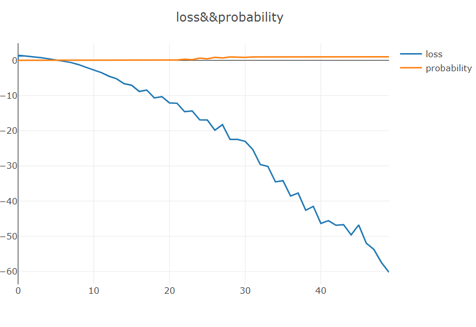
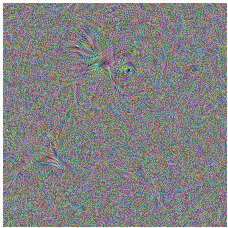
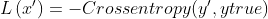
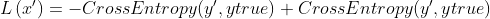
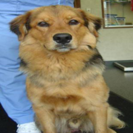
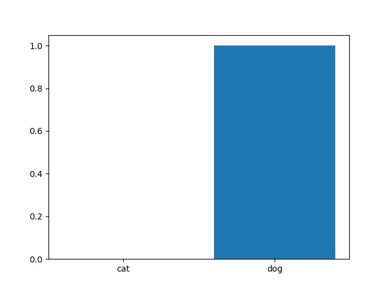
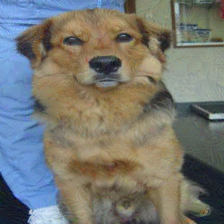
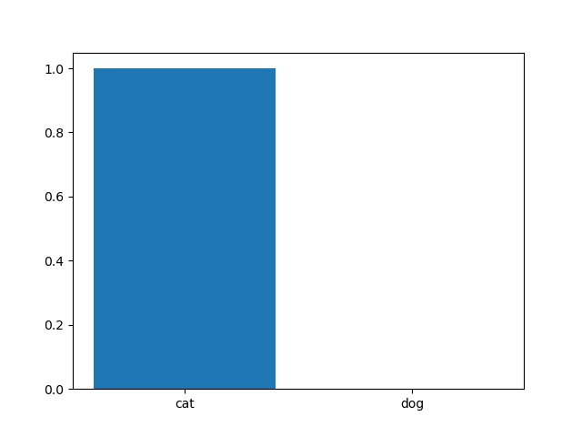
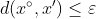

# attack-and-defense
2020.08.07,我看完了李宏毅老师的神经网络攻击与防御篇章的课程后，感悟颇深。由于神经网络的参数量较大，这导致了我们很难地理解每一个参数的意义，也导致了神经网络的可解释性差。因此，人们通常将其称为黑盒。为了打开这一个潘多拉魔盒，目前已有许多的学者投身于解决神经网络解释性差的问题。近些年来，学者们也已经提出了许多的方法来可视化神经网络做出决策的依据，如CAM和GRAD-CAM。这两种方法是通过卷积层的feature map来构建图像的heatmap，使得人们能够直觉地观看到卷积神经网络所看到的“图像区域”。这也推动了神经网络能够走出实验室，真正地应用到现实生活之中。但是在实际情况之中，神经网络所面临的输入环境是复杂多样，它不仅会收到各种各样的输入格式，如PNG,JPG等等。除此之外，它也可能收到包含各种各样的内容的图像（如不包含识别object的图像）。对于神经网络，无论收到何种内容的图像，它最终都会给出一个probability distribution。所以，当我们给其一张不包含其分类object的图像时，它一定会将其归类为其中一类。这显然是不合理。对于这一个问题，我们可以通过引入的一个other class来解决。除此之外，神经网咯采用分层机制逐步地从pixel space来提取图像的语义信息。当图像被加入了肉眼无法区分的噪声时，这可能导致模型分类错误。所以，神经网络既是intellegence,也是fool。
# Experiment
1.证明对于给定的object的图像和不包含此obejct的图像，神经网络可能会将其分类为第一类。  
在这里，我使用最大激活值的方法来最大化在imagenet上训练的vgg16网络的某一label概率以获得其输入图像。代码见generate.py。迭代过程中，输入图像的LOSS和其对应label的概率如下图所示：  
  
  
对于卷积神经网络能够将不包含给定object的图像也分为了object class的解释如下：训练图像的space为现实生活的一个subsapce,我们将模型在这一个subspace所学习到的分类界面放入到一个更大的space中，虽然它能够很好地划分subspace中的object,但是它却缺少了subspace中的objects与那个更大的space中其它object的分界线。所以这导致了模型在一个更大的space中，它也能够将不包含给定Object对象的图像也为object类。这也是在可视化模型结果的时候，我们需要引入图像领域的prior knowledge的原因。  
2.白盒攻击  
白盒攻击是在我们知道给定模型的参数时对特定图像进行攻击，使模型分类错误。这其中又可以分为无目标的攻击和特定目标的攻击。对于前者，我们要求模型错误地分类给定的图像；而对于后者，我们不仅要求模型错误地分类给定的图像，还要将其分类为我们所指定的某一类。两者的loss function如下所示：  
无目标的loss function  
  
有目标的loss function  
  
在这里，我使用了无目标攻击的Loss function来修改给定的image。原始图像如下所示:  
  
模型对于该image的probability distribution如下所示:  
  
修改后的图下如下所示:  
  
模型对于该image的probability distribution如下所示:  
  
根据我对实验现象的观察可知，当image中出现一定的纹理时，模型就会将其错认为cat。而且这种方法貌似很难让模型错误地分类未出现肉眼可见的改变的图像。所以，这是本实验的缺陷。  
NOTE：在改变原始图像的pixel时，我们需要对其改变范围进行限制，以保证修改完的图像中保留了原始图像的特征。假如图像的内容连肉眼也无法分类，那么这样地攻击也就失去了意义。（个人认为）  
图像的限制:  
  
l2范数  
  
无穷范数  
  
3.黑盒攻击  
除了白盒攻击之外，我们还可以使用黑盒攻击。黑盒攻击是在未知模型参数的情况下来对模型进行攻击。  
（1）假若我们知道训练的数据集，那么我们可以使用一个模型来mimic我们要攻击的模型，再进而使用白盒攻击的方法来获得攻击的image。  
（2）假若我们不知道训练的数据集，我们也可以通过模型来分类我们输入的大量数据集，并以此充当模型的训练数据集。然后，我们再用(1)的方法来获得攻击的image。  
4.防御  
防御分为被动防御和主动防御。  
被动防御有smoothing,squeeze和randomization。其中smoothing相当于滤波器，它能够帮助我们平滑image的像素。  
主动防御，相当于我们将攻击的image也加入到训练数据集中来训练模型。
